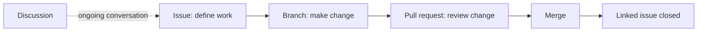

# Collaborate using GitHub

GH-900 expects you to choose the right collaboration surface and explain how work moves between them.

<figure class="product-visual">
    
    <figcaption>Official GitHub Docs product visual: reviewing a <a href="https://docs.github.com/en/pull-requests/collaborating-with-pull-requests/proposing-changes-to-your-work-with-pull-requests/about-pull-requests">pull request</a>.</figcaption>
</figure>

| Tool | Best for | Connection to other work |
| --- | --- | --- |
| Issue | A task, bug, idea, or question | Can be assigned, labeled, tracked in a project, and linked to a pull request |
| Pull request | Reviewing and merging a proposed change | Can close a linked issue after merge |
| Discussion | Open-ended conversation and knowledge sharing | Keeps non-actionable conversation outside issue queues |
| Notification | Awareness of subscribed activity | Can be filtered and configured to protect focus |
| Gist, Wiki, Pages | Sharing a snippet, project knowledge, or published site | Supports communication beyond source files |

*Original visual based on the collaboration tools and issue-to-pull-request linkage named in the [official objectives](https://learn.microsoft.com/en-us/credentials/certifications/resources/study-guides/gh-900).* 

## Collaboration controls

| Feature | Reason to use it |
| --- | --- |
| Templates | Make issues and pull requests provide consistent context. |
| Labels and filters | Sort work by type, priority, status, or area. |
| Assignments | Clarify who is responsible for next action. |
| Saved replies | Reuse accurate, courteous responses to repeated requests. |
| Notifications | Follow relevant work without manually checking every repository. |

Review [GitHub Issues](https://docs.github.com/en/issues), [pull requests](https://docs.github.com/en/pull-requests), and [discussions](https://docs.github.com/en/discussions).

## Choose the right collaboration surface

| If the team needs to... | Start with | Why |
| --- | --- | --- |
| Track a bug, task, request, or planned improvement | Issue | It creates an actionable item that can be assigned, labeled, and linked. |
| Propose a specific change to repository content | Pull request | It presents a branch difference for discussion, review, checks, and merge. |
| Ask an open question or share knowledge | Discussion | It keeps conversational topics separate from the actionable work queue. |
| Publish concise project documentation | Wiki or GitHub Pages | A wiki documents within the project; Pages publishes a site. |
| Share a small standalone code or text example | Gist | It is suited to a lightweight snippet rather than a full repository. |

## Issue to pull-request lifecycle

1. Record the need as an issue when the team needs a trackable work item.
2. Add a clear title, context, acceptance criteria, labels, and an assignee when appropriate.
3. Create a branch that addresses the issue.
4. Commit and push the implementation.
5. Open a pull request and link it to the issue.
6. Request review, respond to comments, and allow required checks to complete.
7. Merge when requirements are met; use a closing keyword where the workflow should close the linked issue.

| Artifact | What good context looks like |
| --- | --- |
| Issue | Problem statement, expected result, reproduction or acceptance criteria, priority, and ownership. |
| Pull request | Why the change is needed, what changed, validation evidence, risk, and a link to related work. |
| Review | Specific feedback, requested changes, approvals, and awareness of automated checks. |

## Templates, filters, and assignments

| Feature | How it improves collaboration |
| --- | --- |
| Issue template | Prompts reporters for consistent problem details. |
| Pull-request template | Prompts authors for scope, testing, and review context. |
| Labels | Categorize work by type, priority, area, or status. |
| Filters | Help a user find the subset of issues or pull requests needing attention. |
| Assignees | Make the next responsible person explicit. |
| Saved replies | Speed up accurate, repeatable responses while preserving a human review. |

## Notifications as workflow management

Notifications are not only alerts; they are a way to manage attention.

| Situation | Useful notification action |
| --- | --- |
| A change needs your review | Watch for review requests and respond from the relevant inbox filter. |
| A repository is too noisy | Adjust subscription level or unsubscribe from work that is not relevant. |
| You need to monitor a specific discussion | Subscribe to the discussion or participating thread. |
| You need a reliable daily triage | Use notification filters to separate review, mention, and participating activity. |

## Documentation and sharing options

| Feature | Strong fit |
| --- | --- |
| Gist | A focused snippet, configuration example, or small note. |
| Wiki | Longer-lived documentation maintained alongside a project. |
| GitHub Pages | A published static site for project, personal, or organizational information. |
| Discussion | Knowledge exchange that benefits from replies and categories. |

## Readiness check

- Choose issue, pull request, discussion, gist, wiki, or Pages for five different scenarios.
- Explain how an issue and pull request can be linked without being the same artifact.
- Describe the purpose of templates, labels, filters, assignments, and saved replies.
- Explain how notification settings protect attention without losing important review work.

<b>Suggested answers</b>

1. **Choose the surface:** Use an issue for actionable work, a pull request for a proposed branch change, a discussion for open conversation, a gist for a small standalone snippet, a wiki for project documentation, and Pages for a published static site.
2. **Linked work:** The issue records the need or task; the pull request records the proposed implementation. A link gives traceability and can close the issue after a qualifying merge, but each artifact still has its own purpose.
3. **Collaboration controls:** Templates ask for consistent information, labels categorize work, filters narrow the work list, assignments clarify ownership, and saved replies speed up frequent accurate responses.
4. **Notifications:** A user can subscribe to relevant repositories or threads and use notification filters for review requests, mentions, and participating activity. This keeps required attention visible while reducing unrelated noise.

