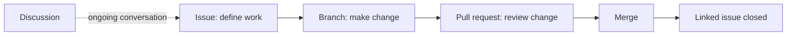

# Collaborate using GitHub

GH-900 expects you to choose the right collaboration surface and explain how work moves between them.

    
    
Official Microsoft Learn visual reference: <a href="https://learn.microsoft.com/en-us/training/modules/communicate-using-markdown/">Communicate effectively on GitHub using Markdown</a>.

| Tool | Best for | Connection to other work |
| --- | --- | --- |
| Issue | A task, bug, idea, or question | Can be assigned, labeled, tracked in a project, and linked to a pull request |
| Pull request | Reviewing and merging a proposed change | Can close a linked issue after merge |
| Discussion | Open-ended conversation and knowledge sharing | Keeps non-actionable conversation outside issue queues |
| Notification | Awareness of subscribed activity | Can be filtered and configured to protect focus |
| Gist, Wiki, Pages | Sharing a snippet, project knowledge, or published site | Supports communication beyond source files |

*Original visual based on the collaboration tools and issue-to-pull-request linkage named in the [official objectives](https://learn.microsoft.com/en-us/credentials/certifications/resources/study-guides/gh-900).* 

## Collaboration controls

| Feature | Reason to use it |
| --- | --- |
| Templates | Make issues and pull requests provide consistent context. |
| Labels and filters | Sort work by type, priority, status, or area. |
| Assignments | Clarify who is responsible for next action. |
| Saved replies | Reuse accurate, courteous responses to repeated requests. |
| Notifications | Follow relevant work without manually checking every repository. |

Review [GitHub Issues](https://docs.github.com/en/issues), [pull requests](https://docs.github.com/en/pull-requests), and [discussions](https://docs.github.com/en/discussions).