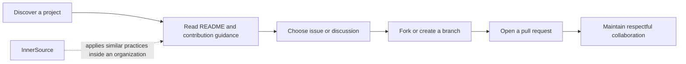

# Explore the GitHub community

GitHub is a collaboration network as well as a code-hosting platform. The exam's community domain emphasizes responsible participation and discoverability.

<figure class="product-visual">
    
    <figcaption>Official GitHub Docs product visual: proposing a community profile improvement for <a href="https://docs.github.com/en/communities/setting-up-your-project-for-healthy-contributions">healthy contributions</a>.</figcaption>
</figure>

| Concept | Why it matters |
| --- | --- |
| Open source | Lets people inspect, use, improve, and share work under its license. |
| GitHub Sponsors | Supports open-source maintainers financially. |
| Following | Keeps you informed about people and organizations you care about. |
| Marketplace | Helps discover integrations and apps that extend GitHub. |
| InnerSource | Applies open-source-style practices inside an organization. |
| Forks and templates | Encourage reuse and contribution while preserving a starting point. |

*Original visual based on the open-source engagement topics in the [Microsoft Learn GH-900 study guide](https://learn.microsoft.com/en-us/credentials/certifications/resources/study-guides/gh-900).* 

## Healthy participation

| Before contributing | During contribution | After contribution |
| --- | --- | --- |
| Read the license, `README`, and `CONTRIBUTING` guidance. | Keep the change focused and communicate clearly in the pull request. | Respond to feedback and learn the project's maintenance expectations. |

Learn with [Contribute to an open-source project on GitHub](https://learn.microsoft.com/en-us/training/modules/contribute-open-source/) and [Manage an InnerSource program](https://learn.microsoft.com/en-us/training/modules/manage-innersource-program-github/).