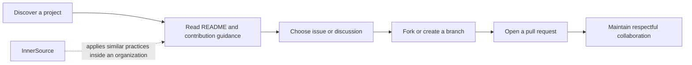

# Explore the GitHub community

GitHub is a collaboration network as well as a code-hosting platform. The exam's community domain emphasizes responsible participation and discoverability.

<figure class="product-visual">
    
    <figcaption>Official GitHub Docs product visual: proposing a community profile improvement for <a href="https://docs.github.com/en/communities/setting-up-your-project-for-healthy-contributions">healthy contributions</a>.</figcaption>
</figure>

| Concept | Why it matters |
| --- | --- |
| Open source | Lets people inspect, use, improve, and share work under its license. |
| GitHub Sponsors | Supports open-source maintainers financially. |
| Following | Keeps you informed about people and organizations you care about. |
| Marketplace | Helps discover integrations and apps that extend GitHub. |
| InnerSource | Applies open-source-style practices inside an organization. |
| Forks and templates | Encourage reuse and contribution while preserving a starting point. |

*Original visual based on the open-source engagement topics in the [Microsoft Learn GH-900 study guide](https://learn.microsoft.com/en-us/credentials/certifications/resources/study-guides/gh-900).* 

## Healthy participation

| Before contributing | During contribution | After contribution |
| --- | --- | --- |
| Read the license, `README`, and `CONTRIBUTING` guidance. | Keep the change focused and communicate clearly in the pull request. | Respond to feedback and learn the project's maintenance expectations. |

Learn with [Contribute to an open-source project on GitHub](https://learn.microsoft.com/en-us/training/modules/contribute-open-source/) and [Manage an InnerSource program](https://learn.microsoft.com/en-us/training/modules/manage-innersource-program-github/).

## Open-source participation

Open source is not only about access to code. Healthy participation relies on clear licensing, discoverability, documentation, respectful communication, and maintainable contribution practices.

| Concept | What to understand |
| --- | --- |
| Open source | Work made available under a license that defines how it may be used, changed, and shared. |
| Maintainer | A person or team responsible for the health and direction of a project. |
| Contributor | A person who improves a project through code, documentation, triage, feedback, or other work. |
| Code of conduct | Community expectations for respectful participation. |
| Contribution guidance | Instructions that make collaboration more predictable. |
| GitHub Sponsors | A way to financially support eligible open-source contributors and organizations. |

## Discoverability and engagement

| Feature | Why it helps |
| --- | --- |
| Follow a user or organization | Receive updates about activity that matters to you. |
| Star a repository | Signal interest and make a project easier to find later. |
| Topics and discoverable repositories | Help people find projects by subject area. |
| GitHub Marketplace | Discover apps and integrations that extend GitHub workflows. |
| Templates | Give new projects a consistent starting structure. |
| Forks | Let people make an independent copy and propose changes to an upstream project. |

## Forks compared with templates

| Question | Fork | Template repository |
| --- | --- | --- |
| Why use it? | Contribute to or experiment with an existing project. | Start a new project from a reusable baseline. |
| Relationship to source | Designed to support an upstream contribution relationship. | Creates a new repository structure without the same contribution intent. |
| Typical next step | Make a change, then open a pull request to the upstream project. | Customize the new repository for its own purpose. |

## InnerSource

InnerSource applies open-source-style practices inside an organization. It helps internal projects become easier to discover, understand, and improve across team boundaries.

| InnerSource practice | Benefit |
| --- | --- |
| Discoverable internal repositories | People can find reusable work instead of recreating it. |
| Clear `README` and contribution guidance | New contributors understand purpose and contribution expectations. |
| Shared issue and pull-request workflows | Teams can collaborate across organizational boundaries. |
| Maintainer guidance | Contributors know where to ask questions and how decisions are made. |
| Visible roadmap or project tracking | Potential contributors can identify useful work. |

## Contribution workflow

1. Find a project and read its `README`, license, code of conduct, and contribution guidance.
2. Search existing issues and discussions before opening a new one.
3. Agree on the proposed work when the project asks for that step.
4. Fork or branch according to the project's contribution model.
5. Make a focused change and validate it locally.
6. Open a clear pull request that follows the project's template and guidance.
7. Respond constructively to maintainer feedback.

## Readiness check

- Explain the value of open source, GitHub Sponsors, and following users or organizations.
- Choose fork or template repository for a contribution versus a new-project scenario.
- Explain what Marketplace is for without confusing it with a repository or package registry.
- Describe InnerSource without claiming that it makes private company code public.
- List the first four things to inspect before contributing to a project.