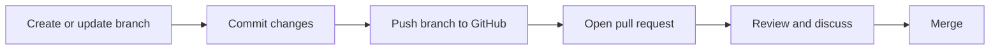

# Understand Git and GitHub basics

This is the largest GH-900 domain. Focus on why version control exists, distinguish local Git from the GitHub platform, and understand the collaboration flow.

<figure class="product-visual">
    
    <figcaption>Official GitHub Docs product visual: branch creation in the <a href="https://docs.github.com/en/get-started/using-github/github-flow">GitHub Flow</a>.</figcaption>
</figure>

| Concept | Study it as | Quick check |
| --- | --- | --- |
| Version control | A recorded, recoverable history of changes | Why is a commit more useful than saving `final-v7`? |
| Git | The distributed version-control system | Which actions can happen locally? |
| GitHub | A platform for hosting, collaborating, and automating around Git repositories | Which features depend on the hosted platform? |
| Repository, commit, branch | The project container, history entry, and independent line of work | How do they relate during a change? |
| GitHub Flow | A lightweight branch and pull-request collaboration approach | What is reviewed before merging? |

*Original visual of the GitHub Flow concepts named in the [official GH-900 study guide](https://learn.microsoft.com/en-us/credentials/certifications/resources/study-guides/gh-900).* 

## Tools and communication

| Item | When it helps |
| --- | --- |
| Markdown | Writing readable issues, pull requests, READMEs, and discussions |
| GitHub Desktop | A graphical Git workflow for common repository operations |
| GitHub Mobile | Reviewing activity and staying connected while away from a desktop |
| Account, organization, enterprise | Personal use, team ownership, and centrally administered environments |

Learn the vocabulary in [Introduction to Git](https://learn.microsoft.com/en-us/training/modules/intro-to-git/) and [Introduction to GitHub](https://learn.microsoft.com/en-us/training/modules/introduction-to-github/).

## Version control fundamentals

Version control records how a project changes over time. Instead of keeping disconnected copies such as `proposal-final-2`, a team has an inspectable history that identifies what changed, when it changed, and the related commit.

| Term | Meaning | Why it matters in a scenario |
| --- | --- | --- |
| Working directory | The files currently being edited on a machine | It can contain changes that have not yet been recorded. |
| Repository | A project plus its version-control history | A repository can be local, hosted, or both. |
| Commit | A recorded snapshot with a message and history relationship | It creates a meaningful checkpoint for review, recovery, and collaboration. |
| Branch | An independent line of development | It isolates a proposed change from the default branch. |
| Merge | Combining an accepted branch change into another branch | It integrates reviewed work into the shared codebase. |
| Remote | A hosted repository that a local repository can synchronize with | It supports sharing branches and collaborating through GitHub. |

### Git compared with GitHub

| Question | Git | GitHub |
| --- | --- | --- |
| What is it? | A distributed version-control system. | A platform for hosting and collaborating around Git repositories. |
| Can it work offline? | Yes, local commits and branches can be created offline. | Hosted collaboration features need a connection to GitHub. |
| What does it manage? | File history, commits, branches, and merges. | Repositories plus pull requests, issues, Actions, Projects, access controls, and community features. |
| Typical command or action | Create a commit or switch branch locally. | Open a pull request or configure repository settings. |

### Benefits to recognize

| Need | Version-control benefit |
| --- | --- |
| Recover from an unwanted change | Compare with or return to a known commit. |
| Let multiple people work safely | Use branches and merge reviewed changes. |
| Understand why a change happened | Review commit messages, pull requests, and linked issues. |
| Test a new idea without destabilizing shared work | Work in a branch before proposing a merge. |

## Accounts, organizations, and enterprise

| Scope | Use it when | Key study point |
| --- | --- | --- |
| Personal account | A person owns their identity and personal repositories. | A user can belong to organizations while retaining a personal account. |
| Organization | A team needs shared ownership, members, teams, and repositories. | Organizations centralize collaboration and access management. |
| Enterprise | A large organization needs broader governance across organizations. | Enterprise options support centrally managed policy and administration. |

Do not treat an organization as merely a folder of repositories. It is also a collaboration and administration boundary with members, teams, roles, settings, and policies.

## GitHub Flow walkthrough

1. Start from an up-to-date default branch.
2. Create a descriptive branch for one coherent change.
3. Make and commit the change with an informative message.
4. Push the branch to GitHub.
5. Open a pull request that explains the purpose and scope.
6. Review, discuss, test, and address feedback.
7. Merge when the repository's requirements are met.
8. Delete the merged branch when it is no longer needed.

The details vary by repository. The exam objective is the collaboration idea: work is isolated, visible, reviewed, and deliberately merged.

## Markdown essentials

Markdown helps people scan and understand work in issues, pull requests, discussions, and documentation.

| Goal | Markdown pattern | Good use |
| --- | --- | --- |
| Create hierarchy | `# Heading` and `## Heading` | Separate context, proposal, and validation notes. |
| Make a list | `- item` or `1. item` | Show steps, acceptance criteria, or alternatives. |
| Emphasize code | Backticks around `code` | Identify commands, files, and configuration keys. |
| Link context | `[label](URL)` | Connect a pull request to a design, issue, or documentation page. |
| Track a checklist | `- [ ] task` | Make remaining review or release work visible. |

## Readiness check

Before moving on, explain all of the following without looking at notes:

- Why a commit can be created locally even when GitHub is unavailable.
- Why a pull request is a collaboration surface rather than a replacement for a branch.
- When a team should use a personal account, organization, or enterprise context.
- How Markdown makes an issue or pull request easier to review.
- The difference between GitHub Desktop, GitHub Mobile, and the web experience.

<b>Suggested answers</b>

1. **Local commits:** Git records commits in the local repository, so creating a commit does not require a connection to GitHub. A connection is needed later to push the branch and use hosted collaboration features.
2. **Pull request and branch:** A branch isolates the proposed change. A pull request is the hosted collaboration space where people can compare that branch, discuss it, request review, run checks, and decide whether to merge it.
3. **Account scope:** Use a personal account for an individual's identity and personal work, an organization for shared team ownership and administration, and an enterprise context when governance must span organizations at larger scale.
4. **Markdown:** Headings, lists, code formatting, links, and checklists make context, acceptance criteria, commands, and review notes easier to scan.
5. **Client choices:** GitHub Desktop is a graphical client for common Git workflows, GitHub Mobile is for staying connected to GitHub activity while away from a desktop, and the web experience provides hosted repository, collaboration, and settings features in a browser.

