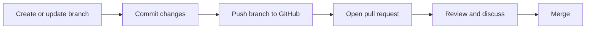

# Understand Git and GitHub basics

This is the largest GH-900 domain. Focus on why version control exists, distinguish local Git from the GitHub platform, and understand the collaboration flow.

<figure class="product-visual">
    
    <figcaption>Official GitHub Docs product visual: branch creation in the <a href="https://docs.github.com/en/get-started/using-github/github-flow">GitHub Flow</a>.</figcaption>
</figure>

| Concept | Study it as | Quick check |
| --- | --- | --- |
| Version control | A recorded, recoverable history of changes | Why is a commit more useful than saving `final-v7`? |
| Git | The distributed version-control system | Which actions can happen locally? |
| GitHub | A platform for hosting, collaborating, and automating around Git repositories | Which features depend on the hosted platform? |
| Repository, commit, branch | The project container, history entry, and independent line of work | How do they relate during a change? |
| GitHub Flow | A lightweight branch and pull-request collaboration approach | What is reviewed before merging? |

*Original visual of the GitHub Flow concepts named in the [official GH-900 study guide](https://learn.microsoft.com/en-us/credentials/certifications/resources/study-guides/gh-900).* 

## Tools and communication

| Item | When it helps |
| --- | --- |
| Markdown | Writing readable issues, pull requests, READMEs, and discussions |
| GitHub Desktop | A graphical Git workflow for common repository operations |
| GitHub Mobile | Reviewing activity and staying connected while away from a desktop |
| Account, organization, enterprise | Personal use, team ownership, and centrally administered environments |

Learn the vocabulary in [Introduction to Git](https://learn.microsoft.com/en-us/training/modules/intro-to-git/) and [Introduction to GitHub](https://learn.microsoft.com/en-us/training/modules/introduction-to-github/).