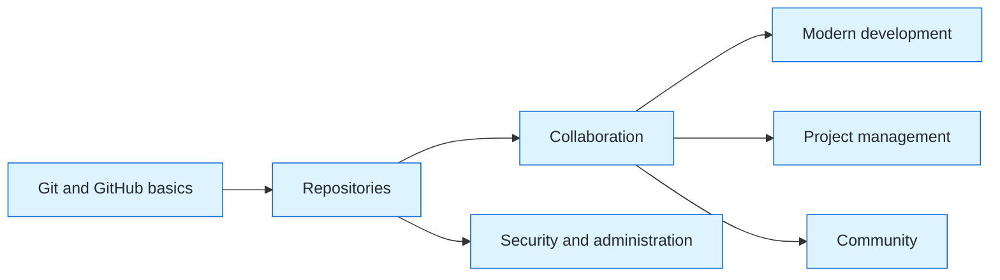

# GH-900 GitHub Foundations Study Guide

{ width="160" }

Prepare for GH-900 by practicing the concepts behind GitHub collaboration, repository work, modern development, governance, and open source. This guide organizes original study notes around the official Microsoft Learn objectives rather than reproducing exam questions.

**Official source and currency.** The domain weights below follow the [GH-900 study guide](https://learn.microsoft.com/en-us/credentials/certifications/resources/study-guides/gh-900), which states that the exam changed significantly in January 2026. Check it again before scheduling an exam.

## Exam map

| Official domain | Weight | Guide page |
| --- | ---: | --- |
| Understand Git and GitHub basics | 25-30% | [Start here](git-github-basics.md) |
| Work with GitHub repositories | 10-15% | [Repositories](repositories.md) |
| Collaborate using GitHub | 10-15% | [Collaboration](collaboration.md) |
| Apply modern development practices | 10-15% | [Modern development](modern-development.md) |
| Manage projects with GitHub | 5-10% | [Project management](project-management.md) |
| Understand privacy, security, and administration | 10-15% | [Security and administration](security-administration.md) |
| Explore the GitHub community | 5-10% | [Community](community.md) |

*Original visual based on the official GH-900 domain grouping. Source: [Microsoft Learn study guide](https://learn.microsoft.com/en-us/credentials/certifications/resources/study-guides/gh-900).* 

## Four-week study rhythm

| Week | Focus | Evidence of readiness |
| --- | --- | --- |
| 1 | Git concepts, GitHub accounts, Markdown, repositories | Explain a commit, branch, merge, and pull request in your own words. |
| 2 | Collaboration, Projects, Actions, Codespaces, Copilot | Create an issue-to-pull-request flow and describe the purpose of each tool. |
| 3 | Access, authentication, repository safety, administration | Choose an appropriate visibility, role, and protection for common scenarios. |
| 4 | Community, review, and practice assessment | Complete the official practice assessment and revisit weak domains. |

## Official preparation

Use the [GitHub Foundations Part 1](https://learn.microsoft.com/en-us/training/paths/github-foundations/) and [Part 2](https://learn.microsoft.com/en-us/training/paths/github-foundations-2/) learning paths. When ready, take the [official practice assessment](https://learn.microsoft.com/en-us/credentials/certifications/github-foundations/practice/assessment?assessment-type=practice).