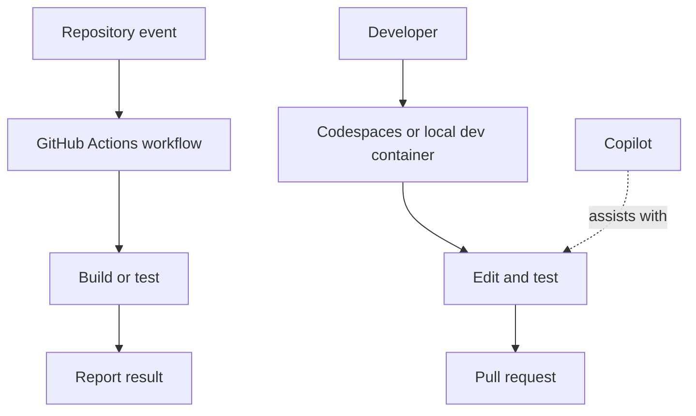

# Apply modern development practices

The exam tests the purpose and boundaries of GitHub's automation, AI, and cloud-development tools, not a specific programming language.

<figure class="product-visual">
    
    <figcaption>Official GitHub Docs visual: the <a href="https://docs.github.com/en/codespaces/overview">Codespaces architecture</a>.</figcaption>
</figure>

| Tool | Primary purpose | Key distinction |
| --- | --- | --- |
| GitHub Actions | Automate workflows such as build, test, and deployment | Workflow automation triggered by repository events |
| GitHub Copilot | AI assistance for coding and related tasks | Suggestions and chat assistance, with plan and policy differences |
| GitHub Codespaces | Cloud-hosted development environment | Full configured environment, often using dev containers |
| `github.dev` | Browser editor for quick edits and exploration | Lighter-weight editor, not a hosted compute environment like Codespaces |
| Dev container | Configuration for a repeatable development environment | Makes tools and setup consistent across developers |

*Original visual synthesizing the modern-development tools listed in the [GH-900 study guide](https://learn.microsoft.com/en-us/credentials/certifications/resources/study-guides/gh-900).* 

## Compare Copilot offerings

| Offering | Study prompt |
| --- | --- |
| Individual | What capabilities and billing model are intended for an individual user? |
| Business | What organization controls and policy needs are introduced for teams? |
| Enterprise | What additional enterprise governance and knowledge-context options matter? |

Use the official documentation for [Actions](https://docs.github.com/en/actions), [Copilot](https://docs.github.com/en/copilot), and [Codespaces](https://docs.github.com/en/codespaces). Product availability can change, so prioritize current documentation over memorized product details.

## GitHub Actions fundamentals

GitHub Actions automates repository-centered work. A workflow is defined in the repository and runs when a configured event or schedule occurs.

| Term | Meaning | Study cue |
| --- | --- | --- |
| Workflow | An automated process defined in a repository | It can build, test, scan, release, or deploy. |
| Event | Something that can trigger a workflow | Examples include push, pull request, schedule, or manual dispatch. |
| Job | A group of steps that run together | A workflow can contain one or more jobs. |
| Step | An individual task in a job | A step can run a command or use an action. |
| Action | A reusable unit of automation | Actions can be used as part of a workflow step. |
| Runner | The machine that executes a job | The runner provides the execution environment. |

### Automation scenario guide

| Need | Likely GitHub capability |
| --- | --- |
| Run tests every time a pull request changes | An Actions workflow triggered by pull-request activity. |
| Publish a release after a tagged commit | An Actions workflow with a relevant release or tag trigger. |
| Perform a repeated repository task on a schedule | A scheduled Actions workflow. |
| Give a developer a consistent cloud environment | Codespaces with dev-container configuration. |
| Get AI-assisted suggestions while coding | GitHub Copilot in a supported environment. |

## GitHub Copilot concepts

Copilot is an AI-powered assistant that can help users generate, explain, transform, and reason about code and related tasks. It is assistance, not an automatic replacement for review, testing, security checks, or ownership.

| Capability named by the objective | What to understand |
| --- | --- |
| Code suggestions | Copilot can propose code while a user works in a supported editor. |
| Chat | A user can ask questions, request explanations, or iterate on a task conversationally. |
| Agents and Agent Mode | Agent capabilities can help work through a task using an iterative tool-assisted workflow; users remain responsible for review. |
| Multi-model support | Available model choices can affect how users interact with supported Copilot experiences. |
| Policy management | Organizations can govern use through plan and organization settings. |

### Copilot plan comparison

| Plan family | Primary study distinction |
| --- | --- |
| Individuals | Intended for individual use and personal account context. |
| Business | Adds organization-oriented management for team use. |
| Enterprise | Adds enterprise-scale governance and capabilities for organizations with broader needs. |

Do not memorize commercial details that can change. Understand why team and enterprise contexts introduce centralized policy and governance needs.

## Codespaces, dev containers, and github.dev

| Tool | Best use | Compute environment | Configuration concept |
| --- | --- | --- |
| Codespaces | Develop, run, and test in a hosted environment | Cloud-hosted environment | Can use a dev container to define tools and setup. |
| Dev container | Standardize environment setup | Used by supporting development environments | Configuration describes the environment and dependencies. |
| github.dev | Browse and make quick edits in a browser | Lightweight editor experience | Not a substitute for a full Codespaces compute environment. |

### Environment workflow

1. Open a repository in Codespaces when the work needs a configured environment.
2. Use or update dev-container configuration when the team needs repeatable tools and dependencies.
3. Make, run, and test changes in the environment.
4. Commit and push changes to a branch.
5. Open a pull request for review and validation.

## Readiness check

- Explain workflow, event, job, step, action, and runner in one sentence each.
- Choose between Actions, Copilot, Codespaces, a dev container, and github.dev for a scenario.
- Explain why an AI suggestion still needs human review and repository checks.
- Describe the governance difference between an individual and an organization-managed Copilot context.