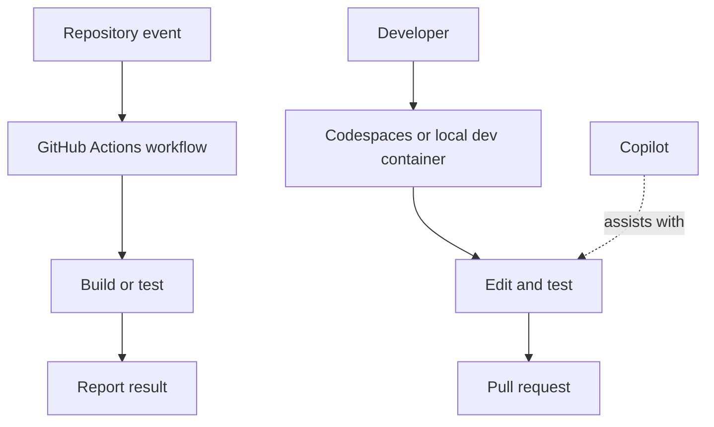

# Apply modern development practices

The exam tests the purpose and boundaries of GitHub's automation, AI, and cloud-development tools, not a specific programming language.

| Tool | Primary purpose | Key distinction |
| --- | --- | --- |
| GitHub Actions | Automate workflows such as build, test, and deployment | Workflow automation triggered by repository events |
| GitHub Copilot | AI assistance for coding and related tasks | Suggestions and chat assistance, with plan and policy differences |
| GitHub Codespaces | Cloud-hosted development environment | Full configured environment, often using dev containers |
| `github.dev` | Browser editor for quick edits and exploration | Lighter-weight editor, not a hosted compute environment like Codespaces |
| Dev container | Configuration for a repeatable development environment | Makes tools and setup consistent across developers |

*Original visual synthesizing the modern-development tools listed in the [GH-900 study guide](https://learn.microsoft.com/en-us/credentials/certifications/resources/study-guides/gh-900).* 

## Compare Copilot offerings

| Offering | Study prompt |
| --- | --- |
| Individual | What capabilities and billing model are intended for an individual user? |
| Business | What organization controls and policy needs are introduced for teams? |
| Enterprise | What additional enterprise governance and knowledge-context options matter? |

Use the official documentation for [Actions](https://docs.github.com/en/actions), [Copilot](https://docs.github.com/en/copilot), and [Codespaces](https://docs.github.com/en/codespaces). Product availability can change, so prioritize current documentation over memorized product details.