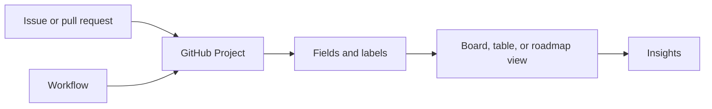

# Manage projects with GitHub

GitHub Projects helps teams view and organize work across issues and pull requests. Learn how project configuration supports a team workflow.

<figure class="product-visual">
    
    <figcaption>Official GitHub Docs product visual: a GitHub Projects <a href="https://docs.github.com/en/issues/planning-and-tracking-with-projects/learning-about-projects/about-projects">board view</a>.</figcaption>
</figure>

| Capability | What to understand |
| --- | --- |
| Layout | Different views make a backlog, board, or planning table easier to scan. |
| Custom fields | Capture information specific to a team's workflow. |
| Labels and milestones | Categorize and group work around shared outcomes or timeframes. |
| Workflows | Automate predictable project updates. |
| Insights | Use project data to understand progress and productivity. |

*Original visual based on the project layouts, workflows, and insights described in the [official GH-900 objectives](https://learn.microsoft.com/en-us/credentials/certifications/resources/study-guides/gh-900).* 

## Scenario practice

| Scenario | A suitable feature |
| --- | --- |
| Triage incoming work by type | Labels and filters |
| Show progress through a shared workflow | Project view plus status field |
| Group work for a release | Milestone |
| Avoid repetitive project updates | Built-in workflow |
| See whether work is moving | Project insights |

Complete [Manage your work with GitHub Projects](https://learn.microsoft.com/en-us/training/modules/manage-work-github-projects/) for hands-on context.

## Project building blocks

GitHub Projects can bring work from issues and pull requests into a shared planning and tracking view. The project is a work-management layer; the linked items still retain their repository context.

| Building block | Purpose | Example |
| --- | --- | --- |
| Item | A tracked unit of work in the project | An issue, pull request, or draft item. |
| Field | A property used to organize or filter items | Status, priority, owner, iteration, or target date. |
| View | A way to see the same work from a different perspective | Table, board, or roadmap. |
| Layout | The visual arrangement used by a view | Columns on a board or rows in a table. |
| Filter | A rule that narrows visible items | Show only high-priority work assigned to one team. |
| Workflow | An automated project update | Set status when a linked item closes. |

## Select a layout

| Layout | Best for | What to watch for |
| --- | --- | --- |
| Table | Comparing many fields at once | Add the columns users need to make decisions. |
| Board | Visualizing a flow through status columns | Keep status definitions clear and mutually understood. |
| Roadmap | Viewing planned work across a time range | Keep date and iteration data current. |

## Labels, milestones, and custom fields

| Feature | Scope | Good use |
| --- | --- | --- |
| Label | Typically categorizes repository work | Classify a bug, feature, priority, or area. |
| Milestone | Groups work around a shared outcome or time boundary | Track work toward a release. |
| Custom field | Captures information in a Project | Track a project-specific priority, effort, or target date. |
| Assignee | Identifies a responsible person | Clarify ownership of a work item. |
| Saved reply | Reuses a frequent response | Speed up predictable communication without losing review. |

## Configure a useful project

1. Define the project outcome and the work items that belong in it.
2. Choose a first view that suits the team's workflow.
3. Add only the fields needed to make decisions.
4. Establish labels, status values, and milestone conventions.
5. Configure workflows for predictable updates.
6. Use filters and saved views to help different roles focus.
7. Review insights to identify stalled work or progress trends.

## Project insights

Insights help convert project data into a progress view. Study the distinction between viewing an individual issue and using project-level information to reason about overall work.

| Question | Relevant project capability |
| --- | --- |
| What work is blocked or still in progress? | Board or filtered project view. |
| Which release outcome does this work support? | Milestone and project fields. |
| Is progress improving over time? | Project insights. |
| Which work needs an owner? | Assignee field and filtered view. |
| Which recurring update should not be manual? | Project workflow. |

## Readiness check

- Select a table, board, or roadmap for three different planning questions.
- Distinguish labels, milestones, custom fields, and assignees.
- Explain how a workflow changes project data without replacing human ownership.
- Describe how project insights differ from a single issue or pull request.

<b>Suggested answers</b>

1. **Layout selection:** A table is useful for comparing several fields, a board is useful for work moving across status columns, and a roadmap is useful for viewing planned work over time.
2. **Organization features:** Labels categorize work, milestones group work around a release or shared outcome, custom fields capture project-specific information, and assignees identify who is responsible for a work item.
3. **Project workflow:** A workflow can update a field when a predictable event happens, such as a linked item closing. It reduces repetitive administration, but a team still owns prioritization, status definitions, and decisions.
4. **Insights:** A single issue or pull request describes one work item. Project insights use aggregated project information to help a team assess progress, trends, and productivity across its work.

