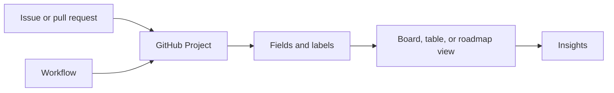

# Manage projects with GitHub

GitHub Projects helps teams view and organize work across issues and pull requests. Learn how project configuration supports a team workflow.

<figure class="product-visual">
    
    <figcaption>Official GitHub Docs product visual: a GitHub Projects <a href="https://docs.github.com/en/issues/planning-and-tracking-with-projects/learning-about-projects/about-projects">board view</a>.</figcaption>
</figure>

| Capability | What to understand |
| --- | --- |
| Layout | Different views make a backlog, board, or planning table easier to scan. |
| Custom fields | Capture information specific to a team's workflow. |
| Labels and milestones | Categorize and group work around shared outcomes or timeframes. |
| Workflows | Automate predictable project updates. |
| Insights | Use project data to understand progress and productivity. |

*Original visual based on the project layouts, workflows, and insights described in the [official GH-900 objectives](https://learn.microsoft.com/en-us/credentials/certifications/resources/study-guides/gh-900).* 

## Scenario practice

| Scenario | A suitable feature |
| --- | --- |
| Triage incoming work by type | Labels and filters |
| Show progress through a shared workflow | Project view plus status field |
| Group work for a release | Milestone |
| Avoid repetitive project updates | Built-in workflow |
| See whether work is moving | Project insights |

Complete [Manage your work with GitHub Projects](https://learn.microsoft.com/en-us/training/modules/manage-work-github-projects/) for hands-on context.