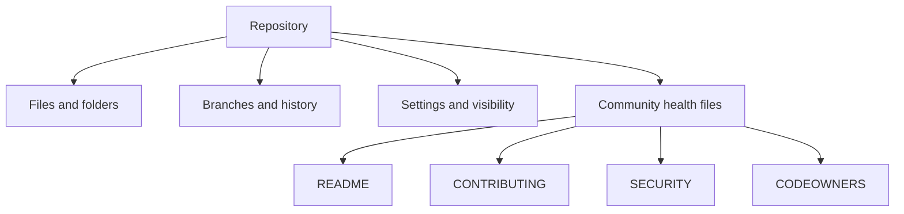

# Work with GitHub repositories

Repositories organize files, history, settings, and collaboration conventions. Be able to recognize common files and describe why maintainers use them.

<figure class="product-visual">
    
    <figcaption>Official GitHub Docs product visual: the <a href="https://docs.github.com/en/repositories/creating-and-managing-repositories/about-repositories">repository creation</a> experience.</figcaption>
</figure>

| Repository item | Purpose | Exam-oriented distinction |
| --- | --- | --- |
| `README` | Explains a project to visitors and contributors | Usually the first orientation document |
| `LICENSE` | States permission terms for reuse | Not the same as contribution guidance |
| `CONTRIBUTING` | Explains how to participate | Sets contribution expectations |
| `CODEOWNERS` | Defines review ownership by path | Helps route review requests |
| `SECURITY` | Explains how to report security issues | Supports responsible disclosure |
| Template repository | Starts a new repository from a reusable structure | Preserves a standard starting point |

*Original visual based on the repository structure and key files listed by [Microsoft Learn](https://learn.microsoft.com/en-us/credentials/certifications/resources/study-guides/gh-900).* 

## Maintain deliberately

| Practice | Why it matters |
| --- | --- |
| Use meaningful branches | Keeps work isolated until it is ready for review. |
| Keep project guidance current | Reduces contributor uncertainty. |
| Review repository insights | Helps understand activity and repository health. |
| Use templates where patterns repeat | Makes new projects consistent and faster to start. |

Study with [Working with repositories](https://docs.github.com/en/repositories) and the official GH-900 study guide.