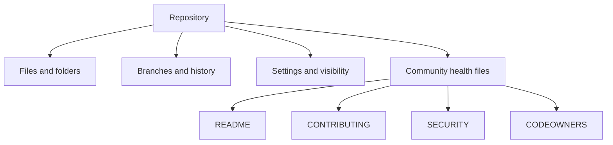

# Work with GitHub repositories

Repositories organize files, history, settings, and collaboration conventions. Be able to recognize common files and describe why maintainers use them.

<figure class="product-visual">
    
    <figcaption>Official GitHub Docs product visual: the <a href="https://docs.github.com/en/repositories/creating-and-managing-repositories/about-repositories">repository creation</a> experience.</figcaption>
</figure>

| Repository item | Purpose | Exam-oriented distinction |
| --- | --- | --- |
| `README` | Explains a project to visitors and contributors | Usually the first orientation document |
| `LICENSE` | States permission terms for reuse | Not the same as contribution guidance |
| `CONTRIBUTING` | Explains how to participate | Sets contribution expectations |
| `CODEOWNERS` | Defines review ownership by path | Helps route review requests |
| `SECURITY` | Explains how to report security issues | Supports responsible disclosure |
| Template repository | Starts a new repository from a reusable structure | Preserves a standard starting point |

*Original visual based on the repository structure and key files listed by [Microsoft Learn](https://learn.microsoft.com/en-us/credentials/certifications/resources/study-guides/gh-900).* 

## Maintain deliberately

| Practice | Why it matters |
| --- | --- |
| Use meaningful branches | Keeps work isolated until it is ready for review. |
| Keep project guidance current | Reduces contributor uncertainty. |
| Review repository insights | Helps understand activity and repository health. |
| Use templates where patterns repeat | Makes new projects consistent and faster to start. |

Study with [Working with repositories](https://docs.github.com/en/repositories) and the official GH-900 study guide.

## Repository anatomy

Repositories are more than file containers. They combine source content, history, branches, settings, access, automation, and contributor guidance.

| Area | What to recognize | Example question cue |
| --- | --- | --- |
| Files and folders | The versioned project content | Where should a setup instruction be documented? |
| Default branch | The primary shared branch for a repository | Which branch usually receives approved work? |
| Branches | Isolated lines of work | How can a change be proposed without directly changing the default branch? |
| Settings | Visibility, access, branch rules, integrations, and features | Which area controls who can act or how a repository is governed? |
| Insights | Information about activity, traffic, dependencies, and repository health | Which feature helps a maintainer understand visibility or activity? |
| Community files | Documentation that guides visitors and contributors | Which file explains a contribution or security process? |

## Community health files in context

| File | Audience | Typical content | Do not confuse it with |
| --- | --- | --- | --- |
| `README` | Everyone visiting the repository | Purpose, setup, use, examples, and high-level context | A license or security reporting policy |
| `LICENSE` | Users and contributors | Legal permissions and conditions for reuse | Instructions for submitting a change |
| `CONTRIBUTING` | Potential contributors | Development process, tests, coding conventions, and pull-request expectations | Repository ownership rules |
| `CODEOWNERS` | Maintainers and reviewers | People or teams responsible for paths | General user permissions |
| `SECURITY` | Security researchers and maintainers | Responsible disclosure and security reporting guidance | A general bug report template |

## Create and organize repositories

When considering a new repository, reason through the following decisions.

| Decision | Questions to ask |
| --- | --- |
| Ownership | Should the repository belong to an individual or an organization? |
| Visibility | Who must be able to discover and access the repository? |
| Initialization | Should it start with a `README`, license, or ignore rules? |
| Reuse | Would a template repository produce a consistent starting point? |
| Collaboration | Which community files, labels, and branch rules will contributors need? |
| Maintenance | Which repository insights and dependency information should maintainers monitor? |

### Templates, forks, and branches

| Tool | Main purpose | Relationship to the source |
| --- | --- | --- |
| Branch | Isolate a change inside one repository | Shares repository history and is typically merged back. |
| Template repository | Start a new repository with a reusable structure | Creates a new project from a baseline. |
| Fork | Create an independent copy, often to contribute to an upstream project | Maintains a relationship that supports proposing changes upstream. |

## File and history management

| Task | Appropriate concept |
| --- | --- |
| Add a file to a proposed change | Create or edit it in a branch, then commit it. |
| Understand a past change | Review history, commits, or blame where appropriate. |
| Locate a repository by topic | Use repository discovery and metadata such as topics. |
| Understand interest and activity | Review stars, insights, metrics, and relevant dashboards. |
| Examine dependency-related information | Use repository dependency insights and security-related features. |

## Maintenance habits

1. Keep the `README` accurate as the project changes.
2. Make contribution and security guidance discoverable.
3. Use branches and pull requests for reviewable work.
4. Keep labels, templates, and repository settings intentional.
5. Review relevant insights and dependency information regularly.
6. Retire stale branches and obsolete guidance.

## Readiness check

- Explain the distinct purpose of every community health file in the objective.
- Choose between a branch, template repository, and fork for a short scenario.
- Identify settings, files, or insights that support repository maintenance.
- Describe why visibility and ownership are early repository decisions.