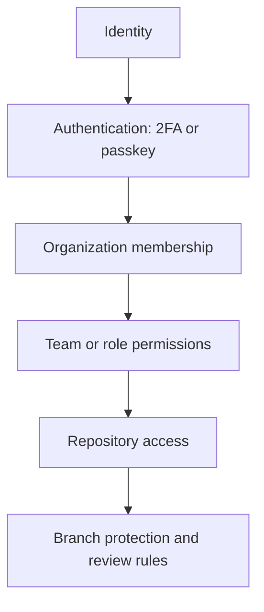

# Understand privacy, security, and administration

This domain asks you to apply least privilege and choose controls that fit the repository and organization context.

<figure class="product-visual">
    
    <figcaption>Official GitHub Docs product visual: adding a security key for <a href="https://docs.github.com/en/authentication/keeping-your-account-and-data-secure/about-authentication-to-github">two-factor authentication</a>.</figcaption>
</figure>

| Control | What it protects or governs | Study cue |
| --- | --- | --- |
| Two-factor authentication and passkeys | Account sign-in | Strengthen identity verification. |
| Repository roles and organization roles | Permissions to act | Grant only the access required. |
| Repository visibility | Who can discover and access a repository | Consider public, private, and internal choices. |
| Branch protection | The conditions required before protected branches change | Connect it to review and status checks. |
| Teams | Group-based access and communication | Simplify consistent organization access. |
| Enterprise Managed Users | Centrally managed enterprise identities | Understand the governance purpose. |

*Original visual based on the security and access-management areas in the [official GH-900 study guide](https://learn.microsoft.com/en-us/credentials/certifications/resources/study-guides/gh-900).* 

## Decision table

| Need | First concept to consider |
| --- | --- |
| Make a contributor prove identity at sign-in | 2FA or passkey |
| Give a group the same repository access | Team and repository role |
| Prevent direct changes to a critical branch | Branch protection rules |
| Govern Copilot across an organization | Organization-wide Copilot policies |
| Control user accounts at enterprise scale | Enterprise Managed Users |

Study [secure repository practices](https://learn.microsoft.com/en-us/training/modules/maintain-secure-repository-github/) and [GitHub administration](https://learn.microsoft.com/en-us/training/modules/github-introduction-administration/).