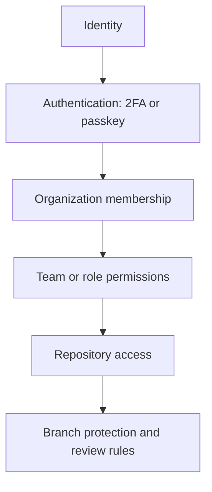

# Understand privacy, security, and administration

This domain asks you to apply least privilege and choose controls that fit the repository and organization context.

<figure class="product-visual">
    
    <figcaption>Official GitHub Docs product visual: adding a security key for <a href="https://docs.github.com/en/authentication/keeping-your-account-and-data-secure/about-authentication-to-github">two-factor authentication</a>.</figcaption>
</figure>

| Control | What it protects or governs | Study cue |
| --- | --- | --- |
| Two-factor authentication and passkeys | Account sign-in | Strengthen identity verification. |
| Repository roles and organization roles | Permissions to act | Grant only the access required. |
| Repository visibility | Who can discover and access a repository | Consider public, private, and internal choices. |
| Branch protection | The conditions required before protected branches change | Connect it to review and status checks. |
| Teams | Group-based access and communication | Simplify consistent organization access. |
| Enterprise Managed Users | Centrally managed enterprise identities | Understand the governance purpose. |

*Original visual based on the security and access-management areas in the [official GH-900 study guide](https://learn.microsoft.com/en-us/credentials/certifications/resources/study-guides/gh-900).* 

## Decision table

| Need | First concept to consider |
| --- | --- |
| Make a contributor prove identity at sign-in | 2FA or passkey |
| Give a group the same repository access | Team and repository role |
| Prevent direct changes to a critical branch | Branch protection rules |
| Govern Copilot across an organization | Organization-wide Copilot policies |
| Control user accounts at enterprise scale | Enterprise Managed Users |

Study [secure repository practices](https://learn.microsoft.com/en-us/training/modules/maintain-secure-repository-github/) and [GitHub administration](https://learn.microsoft.com/en-us/training/modules/github-introduction-administration/).

## Identity and authentication

Security begins with knowing who is accessing GitHub and requiring appropriate proof of identity.

| Control | What it does | Common scenario |
| --- | --- | --- |
| Password | A primary sign-in secret | It should not be the only layer of account protection. |
| Two-factor authentication (2FA) | Requires an additional verification factor | Protect an account when a password is compromised. |
| Passkey | A modern authentication method tied to a device or authenticator | Reduce reliance on reusable passwords. |
| Recovery method | Helps restore access safely | Plan it before an account-access emergency. |
| Enterprise Managed User | An enterprise-managed identity model | Centralize identity lifecycle and access in an enterprise setting. |

## Permission model

The central exam principle is least privilege: grant the smallest level of access that allows someone to do their work, then review it as needs change.

| Scope | What it governs | Examples to recognize |
| --- | --- | --- |
| Repository role | What someone can do in a repository | Read, triage, write, maintain, or administer based on available roles. |
| Team | A reusable group of organization members | Apply consistent access to multiple repositories. |
| Organization role | Organization-level responsibilities | Manage members, settings, or other organization functions. |
| Enterprise role | Enterprise-wide administration responsibilities | Apply governance above individual organizations. |

### Least-privilege scenario guide

| Need | First concept to consider |
| --- | --- |
| A group needs the same repository access | Create or use a team, then grant the appropriate repository role. |
| A user only needs to review triaged issues | Choose a limited repository role rather than administrator access. |
| A central team manages identity at scale | Consider enterprise identity and EMU concepts. |
| A policy needs to apply across an organization | Use the organization administration and policy surface. |

## Visibility and repository protection

| Control | What decision it supports |
| --- | --- |
| Public visibility | The repository can be discovered and accessed publicly. |
| Private visibility | Access is limited to explicitly authorized people or teams. |
| Internal visibility | Access is limited to members of an enterprise where available. |
| Branch protection | Changes to important branches must satisfy configured requirements. |
| Required reviews | A merge needs the designated review conditions. |
| Required status checks | Automated checks must pass before a protected branch accepts changes. |

### Branch-protection reasoning

Branch protection does not replace collaboration. It formalizes the conditions that must be met before a protected branch is changed. In an exam scenario, connect the desired outcome to the appropriate control: review quality, automated validation, or preventing direct unreviewed changes.

## Organization administration and Copilot policy

| Administration area | Why it matters |
| --- | --- |
| Members and teams | Organize people and access at scale. |
| Roles | Delegate responsibility without giving every user full control. |
| Organization settings | Configure features and collaboration behavior. |
| Copilot policy management | Govern Copilot use for organization members. |
| Enterprise Managed Users | Integrate centrally managed identity and governance. |

## Readiness check

- Explain how 2FA and passkeys strengthen account access.
- Choose the least-privileged role or team approach for a simple access scenario.
- Distinguish public, private, and internal visibility.
- Identify when branch protection, review requirements, and status checks apply.
- Describe the governance purpose of EMUs and organization-wide Copilot policies.

<b>Suggested answers</b>

1. **Account protection:** 2FA requires an additional verification factor beyond a password. Passkeys provide a modern authentication approach that can reduce exposure to reusable password credentials.
2. **Least privilege:** Put people with the same access needs into a team and grant that team only the repository role required. Avoid administrator access when read, triage, write, or maintain access is enough.
3. **Visibility:** Public repositories are broadly discoverable, private repositories are restricted to authorized access, and internal repositories are limited to enterprise members where that option is available.
4. **Protected branches:** Use branch protection when important branches need controls such as required reviews, passing status checks, or restrictions on direct updates before changes are merged.
5. **Governance:** Enterprise Managed Users support centrally managed enterprise identity, while organization-wide Copilot policies help administrators govern Copilot use across organization members.

